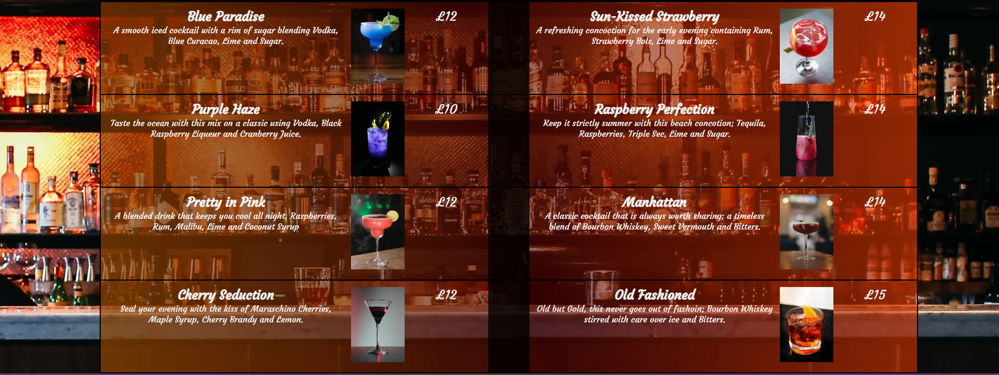
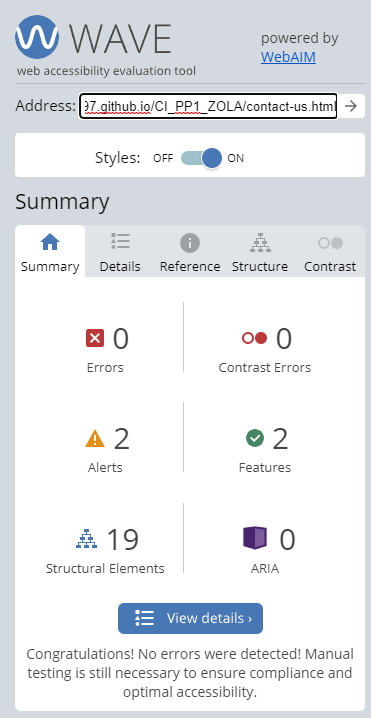

# Zola Bar 

**Developer: James Hart**

[Live website](https://jameshart197.github.io/CI_PP1_ZOLA/)

## Table of Content

  - [Project Goals](#project-goals)
    - [User Goals](#user-goals)
    - [Site Owner Goals](#site-owner-goals)
  - [User Experience](#user-experience)
    - [Target Audience](#target-audience)
    - [User Requirements and Expectations](#user-requirements-and-expectations)
    - [User Stories](#user-stories)
  - [Design](#design)
    - [Colour](#colour)
    - [Fonts](#fonts)
    - [Structure](#structure)
    - [Wireframes](#wireframes)
  - [Technologies Used](#technologies-used)
    - [Languages](#languages)
    - [Frameworks, Libraries & Tools](#frameworks-libraries--tools)
  - [Features](#features)
  - [Validation](#validation)
    - [HTML Validation](#html-validation)
    - [CSS Validation](#css-validation)
  - [Testing](#testing)
    - [Accessibility](#accessibility)
    - [Performance](#performance)
    - [Performing tests on various devices](#performing-tests-on-various-devices)
    - [Browser compatability](#browser-compatability)
    - [Testing user stories](#testing-user-stories)
  - [Bugs](#bugs)
  - [Deployment](#deployment)
  - [Credits](#credits)
  - [Acknowledgements](#acknowledgements)

## Project Goals

### User Goals

- Find a bar to go to on an evening out that creates a social atmosphere.
- Find out what time Zola is open
- Find out where Zola is
- Book a private table/booth for the evening
- See the menu and the drink prices
- Find out more information about who Zola are and what they do
- Find out about any events that might be going on at the bar
- See any offers that might currently be running
- Sign up to be updated on upcoming events and offers
- Apply for a job at Zola
- Enquire for more information

### Site Owner Goals

- Promote the bar to generate more business
- Get guaranteed income through bookings
- Provide information so people know what to expect when they arrive
- Generate extra interest at certain hours through offers/events
- Ensure enquiries are directed to the right people
- Provide as much information as possible so people do not need to telephone/email/ask on site for extra information
- Provide contact details to prospective staff for hiring purposes
- Ensure customers return through the use of newsletters and offers

## User Experience

### Target Audience

- Regular bar goings and social drinkers in the area
- People interested in cocktails
- People interested in live music
- People looking for a place to meet up socially in the area
- Customers looking to return to the bar
- People who may be looking for a job in a bar
- People looking to book a private event or celebration

### User Requirements and Expectations

- Easy navigation throughout the site
- Intuitive usage of the website
- Clear and succinct information presented in a manner that is easy to read
- Information that is easy to find
- All links take you where you expect to go
- Feedback is provided when interacting with the website
  - Links respond to being hovered over
  - Forms confirm that information is correct/incorrect
  - If a mistake is made during navigation a clear 404 page helps you return to the site
- The site provides accessiblity to those who need it in a clear and precise manner
- The site is visually appealing on all devices
- It is easy to achieve simple goals in a small number of steps such as; 
  - Contacting the bar
  - Booking a table
  - Signing up to a newsletter
  - Finding opening hours

### User Stories

#### First-time users

1. As a first time user, I want to know where the bar is so that I can visit
2. As a first time user, I want to know when the bar opens so that I can visit
3. As a first time user, I want to know the price of the drinks so I can budget accordingly
4. As a first time user, I want to know what drinks there are available so I know I will be able to find something I like
5. As a first time user, I want to know if I need to book a table for my large group so that I am not disappointed
6. As a first time user, I want to get a feel for the bar so that I can know what to expect when visiting
7. As a first time user, As a first time user I want to know if there will be any events on when I visit
8. As a first time user, I want to know how I can enquire for more information if I need it
   
#### Returning visitor

9. As a returning user, I want to know if there any special events or offers on that I might be interested in
10. As a returning user, I want to find the telephone number to contact the bar
11. As a returning user, I want to find a way of ensuring I am informed of any upcoming events or offers
12. As a returning user, I want to find a way to make my next visit special due to a celebration or special occasion
13.  As a returning user, I want to find the bar on social media

#### Site Owner

14.	As the site owner, I want the user to understand what Zola represents and get an understanding of the bar
15.	As the site owner, I want the user to be able to book a table
16.	As the site owner, As the site owner I want the user to have a clear understanding of when we are open
17.	As the site owner, I want my site to provide accessibility where required 
18.	As the site owner, I want people to subscribe to the newsletter to generate returning custom
19. As the site owner, I want people to be aware of ongoing events so as to generate more business at those hours. 

## Design

### Colour

For the colour scheme I chose to go with purple, grey, white and black as it matches both the logo of the club and the interior decor. I also feel that these colours provide a professional looking site that is easy to read. When clear contrast was needed, I used cyan to stand out easily from the page. Within the menu element, I used the orange/brown colour that is on the menu in the bar, which blends well with the image of the bar used behind the menu.

 Color Palette
 

### Fonts

I used the Google font Courgette for the main text font as it is similar in style to the name of the bar in the logo, and presents the same feel of elegance and sophistication whilst still being legible. For a fall back font throughout the document I used sans-serif for its compatibility and clarity. In the form area where customers are required to follow instructions I used the Google font Raleway for its clarity and simplicity. I used this Raleway font in the ‘key selling points’ area of the front page to provide contrast and emphasis.

### Structure

The site is structured in a manner that is at once both clear to understand and intuitive for the user to navigate. This was achieved by placing a clear and recognisable navigation bar at the very top of every page, and making sure the header and footer maintained both consistency and simplicity throughout the site. The site’s logo returns the user to the front page and any keywords that link to other areas of the site are clearly marked. All external links open in a new tab and are recognizable as links by use of the FontAwesome icons for those sites. 

The website is divided into four pages and an error 404 page, each of which contains a header and footer with a navigation bar, telephone number and social media links;

1. A home/index page that contains;
  - A captivating hero image
  - clearly marked sections providing the most important information that the site owner would wish the user to find including;
    - The ethos of Zola
    - How to book a table
  - The key selling points of the bar to encourage custom
2. A menu page that contains;
  - Current drink names 
  - Current drink prices
  - Current drink recipes
  - Images of current drinks
3. A what's on page providing;
  - Details of current events
  - Details of current ongoing offers
  - A subscription form for a newsletter to find out about future events
4. A contact us page providing;
  - All contact details of the bar including;
    - Telephone Number
    - Email Address
    - Physical Address
    - A map of the location embedded on the site
  - This page also includes contact information for people looking to apply for a job
 
The 404 page is clearly marked with the same header and footer to allow navigation back to the website. It also contains an image related to the theme of the website in a spilling drink. 

### Wireframes

Desktop and Laptop Screens

Mobile Screens

## Technologies Used

### Languages

- HTML
- CSS

### Frameworks, Libraries & Tools

- [Adobe Color](https://color.adobe.com/) was used to create the colour scheme mock-up you can see in this README.md file.
- [Am I Responsive](http://ami.responsivedesign.is/) was used to create the multi-device mock-up you can see at the start of this README.md file.
- [Am I Responsive](http://ami.responsivedesign.is/) was used to test the responsiveness of the website.
- [Balsamiq](https://balsamiq.com/) was used to create the wireframes for the project.
- [Canva](https://www.canva.com/en_gb/) was used to create the logo for the site.
- [CSS Gradient](https://cssgradient.io/) was used to create gradients within the site backgrounds.
- [Favicon.io](https://favicon.io/) was used to make the favicon for the website. 
- [Font Awesome](https://fontawesome.com/) was used to create recognisable icons throughout the site.
- [Git](https://git-scm.com/) was used for version control, pushing the code to Github.
- [GitHub](https://github.com/) was used for remote storage of the repository for the project code.
- [Google Fonts](https://fonts.google.com/) were used to create the desired styling of text.
- [Google Maps](https://www.google.com/maps) was used to create the embedded map on the contact-us page.
- [Greenshot](https://getgreenshot.org/) was used to create the screenshots in this README.md
- [Pexels](https://www.pexels.com/) was used to find copyright-free pictures that matched the site design.
- [WC3 Validator](https://validator.w3.org/) was used to test the HTML code for the website.
- [Jigsaw W3 Validator](https://jigsaw.w3.org/css-validator/) was used to test the CSS code for the website. 
- [Wave Validator](https://wave.webaim.org/) was used to test the accessibility of the website. 
- [Lighthouse](https://developers.google.com/web/tools/lighthouse/) was used to test the performance of the website. 

## Features

The website consists of a header, footer and four pages as well as a custom 404 page. 

### Header 

- Featured on all pages of the website
- Contains Brand Name and Slogan
- Contains Logo and Navigation bar

### Logo and Navigation Bar

- Logo returns user to the Home page
- Navigation bar takes user to the Home, Menu, Whats On? and Contact Us pages.
- Navigation bar is fully responsive and condenses on mobile screens
- Navigation bar displays current page in black
- Navigation bar displays box around hovered options

### Footer

- Featured on all pages of the website
- Contains Social Media Links (Facebook, Twitter and Instagram)
- Contains Booking Banner for enquiries and bookings and telephone number

## Index Page

### Hero Image

- Scrolls automatically on larger devices, static for responsiveness and loading times on mobile
- Immediately captivates the user
- Immediately tells user the nature of the site (the image is of a bar)
- Responsive on all devices

### Information Panels

- Panel containing information on the ethos of the bar and an image of sharing drinks
- Panel containing information on booking a private booth and an image of the booth mentioned
- These panels contain the information that the owner believes is most important to the site

- Panel containing Key selling points for the bar
- Contains a background image of a busy bar

## Menu Page

### Background Image
- Image is of the backbar, displaying available spirits
- Image is not the important element so is overlayed with a translucent background for clarity of text

### Menu

- Grid element containing drink name, recipe, price and a picture of the drink for each drink on the menu

## What's On Page

### Happy Hour Advert

- Text area saying what happy hour is and when
- Image depicting two drinks to emphasize

### Live Music Advert

- Text area saying when the live music takes place
- Image of live band to emphasize

### Newspaper Banner

- Headline tag to capture attention
- Text explanation below of why you should sign up

### Newsletter Form

- Background image depicting a cocktail for style
- Form elements, required for successful sign-up.
- Gives feedback to user when sign-up button is hovered

## Contact Us Page

- Background image of bar from the outside

- Embedded map of location

- Booking banner containing telephone number and email address

- Opening Times table

- Physical Address
- Information for people looking to apply for a job

## 404 error page

- Image related to both bar and to indicate potential mistake
- Navigation bar in Header to return to main site
- Message explaining that the resource cannot be found and the error code

## Validation

### HTML Validation

The W3C Markup Validation Service was used to validate the HTML of the website. All pages pass with no errors and no warnings.

Index Page

Menu Page

Whats On? Page

Contact Us Page

404 Error page

### CSS Validation

The W3C Jigsaw CSS Validation Service was used to validate the CSS of the website. The site passes with no errors but brings up a single warning. This warning is simply to tell us that the imported style sheet we use to implement Google Fonts onto the website is not checked by the validation. 

CSS Validation

## Testing

### Accessibility

The WAVE WebAIM web accessibility evaluation tool was used to ensure the website met high accessibility standards. Each of the pages passes without errors.

Wave Evaluation Summary for Index Page

Wave Evaluation Summary for Menu Page

Wave Evaluation Summary for Whats On Page

Wave Evaluation Summary for Contact Us Page

Wave Evaluation Summary for 404 Page

### Performance

Google Lighthouse 

See evaluation summary

### Performing tests on various devices

The website was tested using Google Chrome Developer Tools Toggle Device Toolbar to simulate viewports of different devices. 

The website was tested on the following devices:
- 
-
-

### Browser compatability

The website was tested on the following browsers:
- Google Chrome
- Mozilla Firefox

### Testing user stories

1. As a first time user, I want to find out more about the club

| **Feature**   | **Action**                    | **Expected Result**          | **Actual Result** |
| ------------- | ----------------------------- | ---------------------------- | ----------------- |
| 1 | 2 | 3 | 4 |

Screenshot

2. As a first time user, I want to find out if I can join the club if I have never played volleyball before.

| **Feature**                      | **Action**                    | **Expected Result**                                                  | **Actual Result** |
| -------------------------------- | ----------------------------- | -------------------------------------------------------------------- | ----------------- |
| 1 | 2 | 3 | 4 |

Screenshot

3. As a first time user, 

| **Feature**                 | **Action**                    | **Expected Result**     | **Actual Result** |
| --------------------------- | ----------------------------- | ----------------------- | ----------------- |
| 1 | 2 | 3 | 4 |

Screenshot

4. As a first time user, 

| **Feature**                 | **Action**                    | **Expected Result**     | **Actual Result** |
| --------------------------- | ----------------------------- | ----------------------- | ----------------- |
| 1 | 2 | 3 | 4 |

Screenshot

5. As a first time user, 

| **Feature**                 | **Action**                    | **Expected Result**     | **Actual Result** |
| --------------------------- | ----------------------------- | ----------------------- | ----------------- |
| 1 | 2 | 3 | 4 |

Screenshot

6. As a first time user, 

| **Feature**                 | **Action**                    | **Expected Result**     | **Actual Result** |
| --------------------------- | ----------------------------- | ----------------------- | ----------------- |
| 1 | 2 | 3 | 4 |

Screenshot

7. As a first time user, 

| **Feature**                 | **Action**                    | **Expected Result**     | **Actual Result** |
| --------------------------- | ----------------------------- | ----------------------- | ----------------- |
| 1 | 2 | 3 | 4 |

Screenshot

8. As a first time user, 

| **Feature**                 | **Action**                    | **Expected Result**     | **Actual Result** |
| --------------------------- | ----------------------------- | ----------------------- | ----------------- |
| 1 | 2 | 3 | 4 |

Screenshot

9. As a first time user, 

| **Feature**                 | **Action**                    | **Expected Result**     | **Actual Result** |
| --------------------------- | ----------------------------- | ----------------------- | ----------------- |
| 1 | 2 | 3 | 4 |

Screenshot

10. As a first time user, 

| **Feature**                 | **Action**                    | **Expected Result**     | **Actual Result** |
| --------------------------- | ----------------------------- | ----------------------- | ----------------- |
| 1 | 2 | 3 | 4 |

Screenshot

11. As a first time user, 

| **Feature**                 | **Action**                    | **Expected Result**     | **Actual Result** |
| --------------------------- | ----------------------------- | ----------------------- | ----------------- |
| 1 | 2 | 3 | 4 |

Screenshot

12. As a first time user, 

| **Feature**                 | **Action**                    | **Expected Result**     | **Actual Result** |
| --------------------------- | ----------------------------- | ----------------------- | ----------------- |
| 1 | 2 | 3 | 4 |

Screenshot

13. As a first time user, 

| **Feature**                 | **Action**                    | **Expected Result**     | **Actual Result** |
| --------------------------- | ----------------------------- | ----------------------- | ----------------- |
| 1 | 2 | 3 | 4 |

Screenshot

14. As a first time user, 

| **Feature**                 | **Action**                    | **Expected Result**     | **Actual Result** |
| --------------------------- | ----------------------------- | ----------------------- | ----------------- |
| 1 | 2 | 3 | 4 |

Screenshot

15. As a first time user, 

| **Feature**                 | **Action**                    | **Expected Result**     | **Actual Result** |
| --------------------------- | ----------------------------- | ----------------------- | ----------------- |
| 1 | 2 | 3 | 4 |

Screenshot

## Bugs

| Bug                                                                                                               | Fix                                                                                                                                       |
| ----------------------------------------------------------------------------------------------------------------- | ----------------------------------------------------------------------------------------------------------------------------------------- |
| 1| 2 |
| 1| 2 |
| 1| 2 |                                                               |
| 1| 2 |
| 1| 2 |
| 1| 2 |
| 1| 2 |
| 1| 2 |
| 1| 2 |

## Deployment

### GitHub Pages
The website was deployed using GitHub Pages by following these steps:
1. In the GitHub repository navigate to the Settings tab
2. On the left hand menu select Pages
3. For the source select Branch: main
4. Once saved, GitHub will refresh and your website will be publishd from GitHub repository
5. The link to your published website will appear: "Your site is published at *link* "

### Forking the GitHub Repository
1. Go to the GitHub repository
2. Click on Fork button in top right corner

### Making a Local Clone
1. Go to the GitHub repository 
2. Locate the Code button above the list of files and click it
3. Highlight the "HTTPS" button to clone with HTTPS and copy the link
4. Open Git Bash
5. Change the current working directory to the one where you want the cloned directory
6. Type git clone and paste the URL from the clipboard ($ git clone https://github.com/YOUR-USERNAME/YOUR-REPOSITORY)
7. Press Enter to create your local clone

## Credits

### Images
[Name](*image*): Information [Name](*link*)
[Name](*image*): Information [Name](*link*)
[Name](*image*): Information [Name](*link*)
[Name](*image*): Information [Name](*link*)
[Name](*image*): Information [Name](*link*)

### Code

-  [name] (link)
- 
- 
- 

## Acknowledgements

- 
- 
- 
- 
 